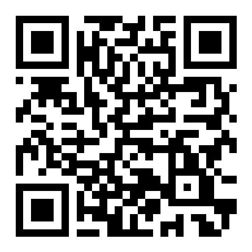

# 📱 PersonalCook QR Code Access

## Quick Access QR Code



### How to Use This QR Code

#### For Android Users:
1. Install **Expo Go** from Google Play Store
2. Open the Expo Go app
3. Tap "Scan QR code" 
4. Point your camera at the QR code above
5. Wait for the app to load (10-30 seconds)
6. Start using PersonalCook! 🍳

#### For iOS Users:
1. Install **Expo Go** from App Store
2. Open your device's **Camera** app
3. Point at the QR code above
4. Tap the notification banner that appears
5. The app will open in Expo Go
6. Start using PersonalCook! 🍳

---

## ⚠️ Important Notes

- **First-time setup**: The QR code currently points to a placeholder URL
- **To generate a working QR code**: Someone with Node.js needs to publish the app first
- **See below** for instructions on how to generate your own QR code

---

## 🔧 How to Generate Your Own QR Code

If you have Node.js installed, you can generate a QR code for your local or published instance:

### Option 1: For Local Development Server

```bash
# 1. Start the development server
npm start

# 2. The terminal will display an Expo URL like:
#    exp://192.168.1.100:8081

# 3. Generate QR code with that URL
npm run generate-qr exp://YOUR-IP:8081
```

This will create:
- `assets/qr-code.png` - Image file you can share
- `QR_CODE.txt` - Text version for terminal

### Option 2: For Published Expo App

```bash
# 1. Install EAS CLI (one-time)
npm install -g eas-cli

# 2. Login to Expo
eas login

# 3. Configure EAS (first-time)
eas build:configure

# 4. Publish the app
eas update --branch production

# 5. You'll get a URL like:
#    exp://u.expo.dev/update/YOUR-PROJECT-ID

# 6. Generate QR code with that URL
npm run generate-qr exp://u.expo.dev/update/YOUR-PROJECT-ID
```

### Option 3: Use the Script Directly

```bash
node generate-qr.js "YOUR-EXPO-URL-HERE"
```

---

## 📤 Sharing Your QR Code

Once you've generated the QR code:

1. **Share the PNG file**: Send `assets/qr-code.png` to others
   - Via email, messaging apps, etc.
   - Print it out for easy scanning

2. **Share the text file**: Send `QR_CODE.txt` to others
   - Contains ASCII art QR code
   - Works in terminals and text files

3. **Update this README**: Replace the placeholder QR code image
   - Commit the new `qr-code.png`
   - Push to GitHub
   - Others can scan directly from this file!

---

## 🆘 Troubleshooting

**QR Code Won't Scan:**
- Make sure your camera can focus on the QR code
- Increase screen brightness
- Try zooming in on the QR code image

**QR Code Scans But App Won't Load:**
- Verify you have Expo Go installed
- Check your internet connection
- Make sure the Expo URL is still valid
- If using local server, ensure both devices are on same WiFi

**Need a Working QR Code Right Now:**
- See [NO_NODE_SETUP.md](NO_NODE_SETUP.md) for alternatives
- Ask someone with Node.js to publish the app
- Or install Node.js yourself from https://nodejs.org

---

## 🔗 More Information

- **Don't have Node.js?** → [NO_NODE_SETUP.md](NO_NODE_SETUP.md)
- **Full setup guide** → [MOBILE_SETUP.md](MOBILE_SETUP.md)
- **Quick start** → [QUICKSTART.md](QUICKSTART.md)
- **Main documentation** → [README.md](README.md)

---

**Made with ❤️ for easy mobile access to PersonalCook!** 🍳
